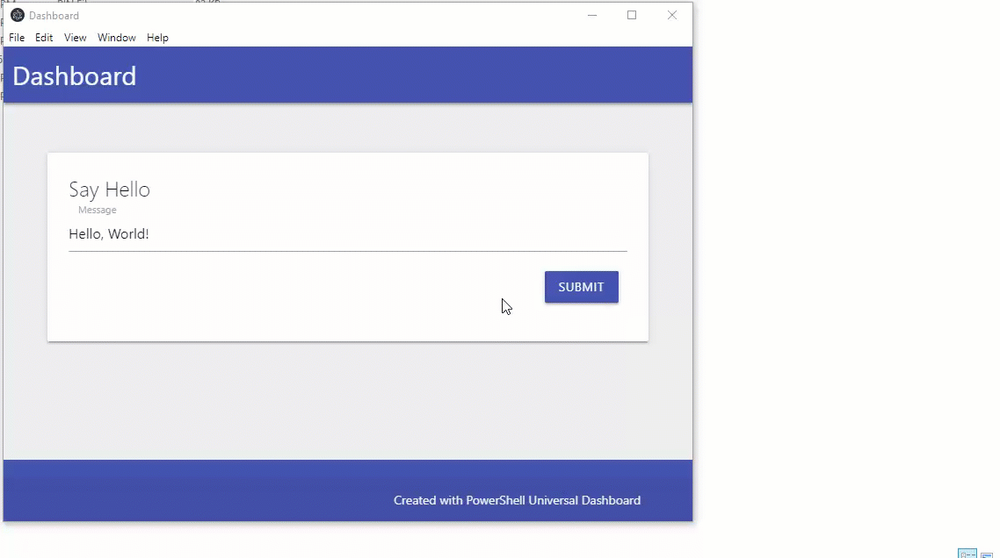

# ud-forge

Build Desktop Apps with Universal Dashboard



# About

Universal Dashboard Forge uses [Electron](https://electronjs.org/) and Electron Forge to build desktops apps with Universal Dashboard.

# Installation

```
Install-Module UniversalDashboard.Forge
```

# Requirements

- [NodeJS ](https://nodejs.org/)
- [PowerShell Core](https://github.com/PowerShell/PowerShell/releases) or Windows PowerShell
- [Git](https://git-scm.com/downloads)

# Dashboard

Your dashboard file needs to be called `dashboard.ps1`, listen on the specified port and use the `-Wait` parameter of `Start-UDDashboard`.

# Usage

Package a single ps1 file as a desktop application.

```
Import-Module UniversalDashboard.Forge
New-UDDesktopApp -Path .\dashboard.ps1 -OutputPath .\out -Name MyApp
.\out\MyApp\out\myapp-win32-x64\MyApp.exe
```

Package a folder as a desktop application. UDForge will verify that the folder contains a dashboard.ps1 file. This file should call `Start-UDDashboard`.

```
Import-Module UniversalDashboard.Forge
New-UDDesktopApp -Path .\dashboard -OutputPath .\out -Name MyApp
.\out\MyApp\out\myapp-win32-x64\MyApp.exe
```

# Installer

An installer is also created in the output directory. This contains all the files necessary for electron, the app and Universal Dashboard.

```
.\MyApp\out\make\squirrel.windows\x64\myapp-1.0.0 Setup.exe
```
